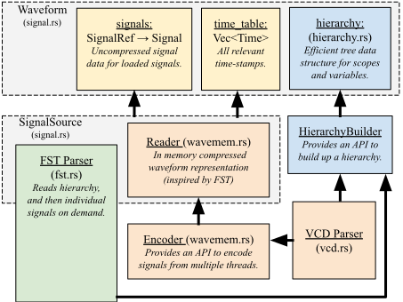

# Wellen Wavform Library

`wellen` provides a common interface to read both FST and VCD waveform files.
The library is optimized for use-cases where only a subset of signals need to
be accessed, like in a waveform viewer.
VCD parsing uses multiple-threads.

## Overview

## The Wellen Hierarchy

All meta-data about the signals in a design is accumulated in the `wellen::Hierarchy` class.
While all formats supported by `wellen` feature hierarchical scopes and variables and the associated signal
data, they vary in how much additional information they provide. We thus had to make some choices on how
to unify the data from various sources in a single data model.

### Global Meta-Data

We record the following information for each file:

- `date`: a string representation of when the file was created, the precise data / time format depends on the file source (VCD, FST)
- `version`: a string, generally the version of the simulator that produced the file (VCD, FST)
- `timescale`: time unit and factor that defines one tick of simulation time, GHW is always `1fs` (ALL)
- `fileformat` (ALL)

### Scope

Each scope contains the following information:

- `name`: the local name of the scope, ignoring its parent scopes (ALL)
- `full_name`: the names of all parent scopes and the local scope, connected with a `.` (ALL)
- `scope_type`: the kind of scope, e.g., module, function, wire (ALL)
- `component`: an optional type name, e.g., the name of the module that was instantiated (FST)
- `instantiation_source_loc`: optional filename and line number where the scope was instantiated;
  for VCDs, this information is encoded with non-standard attributes (FST, VCD)
- `source_loc`: optional filename and line number where the scope was declared;
  for VCDs, this information is encoded with non-standard attributes (FST, VCD)
- `items`: child variables and scopes
- `vars`: child variables
- `scopes`: child scopes

### Variable

Each variables comes with the following information:

- `name`: the local name of the scope, ignoring its parent scopes (ALL)
- `full_name`: the names of all parent scopes and the local scope, connected with a `.` (ALL)
- _to be continued_